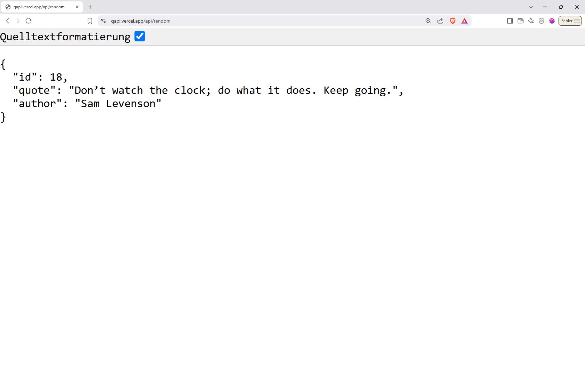

<!-- _paginate: false -->
<!-- _class: invert -->

# Wie bekommt man <br> Daten aus dem Internet? <!-- fit -->

<!-- - Problem: Wetteradten sind nicht bei uns, sondern auf Servern im Internet
- Rhetorische Frage -->
---

## Anwendungen

- :cloud: Wetter anzeigen  
- :bus: Fahrpläne abrufen  
- :watch: Uhrzeit synchronisieren  
- :mag_right: Suchmaschinen nutzen  
- :arrow_forward: YouTube-Videos abspielen  
- :iphone: Fast jede App nutzt Daten aus dem Internet
- etc.

<!-- - Fast alles auf dem Handy braucht Daten aus dem Internet
- Nicht zwingend Suchmaschiene
- Woher kommen die Daten? -->

---

<!-- _class: invert -->

## Lösung - _API_

### **API  = _Application Programming Interface_**

1. Senden einer Anfrage
2. Erhalten einer Antwort

<!--
Beispiel: Abfrage Uhrzeit
-  Gerät sendet Anfrage ("URL")
-  Antwort als "JSON"
-  Antwort abspeichern / Verarbeiten
-  Zeitinensiv
-->

---

<!-- _class: invert -->

## Request  & Response

```ts
let data = await fetch("https://qapi.vercel.app/api/random");
```

```json
{
  "id": 18,
  "quote": "Don’t watch the clock; do what it does. Keep going.",
  "author": "Sam Levenson"
}
```

---

### **JSON = _JavaScript Object Notation_**



---

<!-- _class: invert -->

# Wir programmiere <br> _Back to the Future_    <!-- fit -->

Problem: API-Anfragen sind sehr zeitintensiv

<!-- - Witz über langsames Internet
- Mögliche Übertragungsfehler -->

---


---

<!-- _class: invert -->

## Asyncronität

**async** und **await** ermöglicehn es auf asyncrone Prozesse zu "warten"

---

<!-- _class: invert -->

## Kompliziert

```ts
fetch("https://qapi.vercel.app/api/random")
.then((data: Response) => data.json())
.then((quote: JSON) => console.log(quote.stringify()));

.error((err: Error) => console.log(err));
```

---

<!-- _class: invert -->

## Einfacher

Asynchrone Funktion

```ts
async function displayQuote() {
  let data = await fetch("https://qapi.vercel.app/api/random");
  let quote = await data.json();
  let quoteText = quote.stringify();

  console.log(quoteText);
}
```

---

<!-- _class: invert -->
<!-- _paginate: false -->

## 🧠 Zusammenfassung

- 📡 Daten kommen **nicht vom Gerät**, sondern von **Servern im Internet**
- 🔄 Dafür nutzen wir **APIs**  
  → senden Anfragen, bekommen Antworten (meist in **JSON**)

---

<!-- _class: invert -->
<!-- _paginate: false -->

- ⏱️ Diese Prozesse dauern – deshalb sind sie **asynchron**
- 🧵 Der Code läuft **weiter**, während auf die Antwort gewartet wird
- ✨ Mit `async` / `await` ist das einfacher zu schreiben & zu lesen
