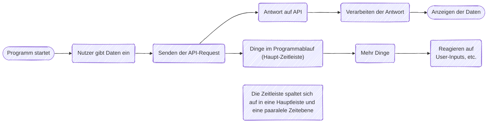

```mermaid
---
config:
  theme: default
  look: handDrawn
---
flowchart LR
    Start([Programm startet])
    Ende([Anzeigen der Daten])
    Input(Nutzer gibt Daten ein)
    Send(Senden der API-Request)

    Response(Antwort auf API)
    Peocess(Verarbeiten der Antwort)

    stuff_1("Dinge im Programmablauf (Haupt-Zeitleiste)")
    stuff_2("Mehr Dinge")
    stuff_3(" Reagieren auf <br> User-Inputs, etc.")


Send  --> Response  --> Peocess --> Ende

Start  --> Input --> Send --> stuff_1 --> stuff_2 --> stuff_3

explain(Die Zeitleiste spaltet sich auf in eine Hauptleiste und eine paaralele Zeitebene)
Send ~~~ explain
```
