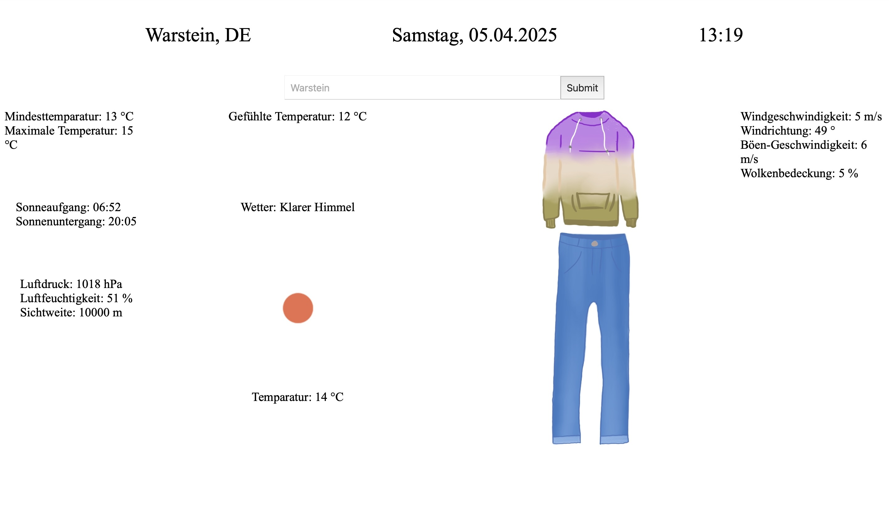

<!-- _class: invert -->

## Inhalt der einzelenen Zellen

```html
<div id="weather-display">
  <div>Wetter: <span id="description"></span></div>
  <div></div>

  <div>Temparatur: <span id="temp"></span> °C</div>
  <div>Gefühlte Temperatur: <span id="feels-like"></span> °C</div>

  <div id="temperature-min-max">
    <div>Mindesttemparatur: <span id="temp-min"></span> °C</div>
    <div>Maximale Temperatur: <span id="temp-max"></span> °C</div>
  </div>
  <div id="air-info">
    <div>Luftdruck: <span id="pressure"></span> hPa</div>
    <div>Luftfeuchtigkeit: <span id="humidity"></span> %</div>
    <div>Sichtweite: <span id="visibility"></span> m</div>
  </div>

  <div id="sky-info">
    <div>Windgeschwindigkeit: <span id="wind-speed"></span> m/s</div>
    <div>Windrichtung: <span id="wind-deg"></span> °</div>
    <div>Böen-Geschwindigkeit: <span id="wind-gust"></span> m/s</div>
    <div>Wolkenbedeckung: <span id="clouds"></span> %</div>
  </div>

  <div id="sun-info">
    <div>Sonneaufgang: <span id="sunrise"></span></div>
    <div>Sonnenuntergang: <span id="sunset"></span></div>
  </div>
  <div id="clothing-recommendation"></div>
</div>
```

---

## Erklärung

Hier befinden wir uns in der **Index.html**. Durch den **<div</div>** tag am Anfang:

```html
<div id="weather-display"></div>
```

wird ein großer **Container** geöffnet, dem wir eine ID zuweisen. Die ID rufen wir in **CSS** durch ein **#** auf.
Innerhalb dieses **Containers** befinden sich noch weitere **Container**, welche die Wetterdaten enthalten.
**Beispiel:**

```html
<div id="sky-info">
    <div>Windgeschwindigkeit: <span id="wind-speed"></span> m/s</div
    ...
```

---

<!-- _class: invert -->

## Grid-Layout

```css
#weather-display {
  display: grid;
  grid-template-areas:
    "temp-min-max feels-like clothing sky-info"
    "sun-info description clothing sky-info"
    "air-info image clothing sky-info"
    "air-info temperature clothing sky-info";
  grid-template-columns: 1fr 2fr 2fr 1fr;
  grid-gap: 10px;
  justify-items: center;

  font-size: 20px;
}
```

---

## Erklärung:

Das CSS-Grid-Layout wird durch den Zugriff auf die ID innerhalb des **weather-display Containers** bestimmt:

```css
#weather-display {
  display: grid;
}
```

Es sorgt dafür, dass die Wetteranzeige eine klare Struktur hat. Die einzelnen Bereiche sind wie folgt zugeordnet:

```css
grid-template-areas:
  "temp-min-max feels-like clothing sky-info"
  "sun-info description clothing sky-info"
  "air-info image clothing sky-info"
  "air-info temperature clothing sky-info";
```

---

Somit erhält man eine Tabelle (**Grid**), in die man die verschiedenen Wetterdaten einordnen kann.

Um diese noch weiter **stylen**, nutzen wir weitere **CSS Eigenschaften**:

```css
grid-template-columns: 1fr 2fr 2fr 1fr;
grid-gap: 10px;
justify-items: center;
font-size: 20px;
```

1. **grid-template-columns**: bestimmt wie groß die einzelen Zellen werden sollen
2. **grid-gap: 10px;**: bestimmt wie groß der Abstand zwischen den Zellen sein soll
3. **justify-items: center;**: positioniert den Inhalt der Zelle mittig
4. **font-size: 20px;** bestimmt Schriftgröße

---

<!-- _class: invert -->

## So kann dieses Layout erzeugt werden:


